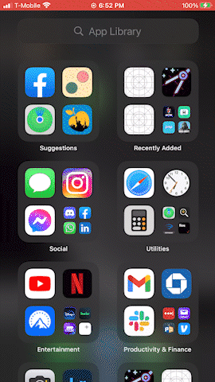
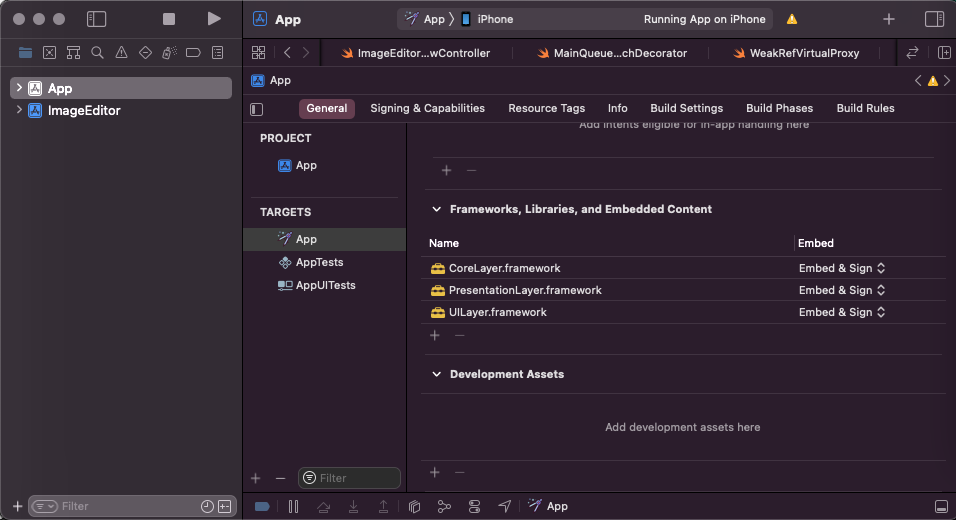
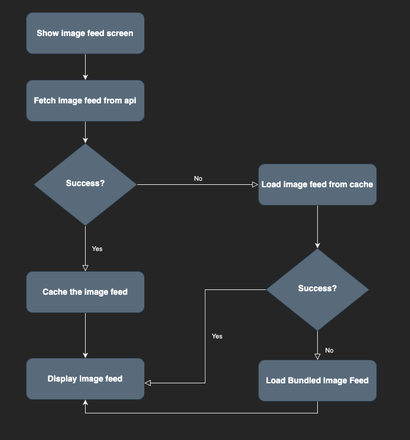
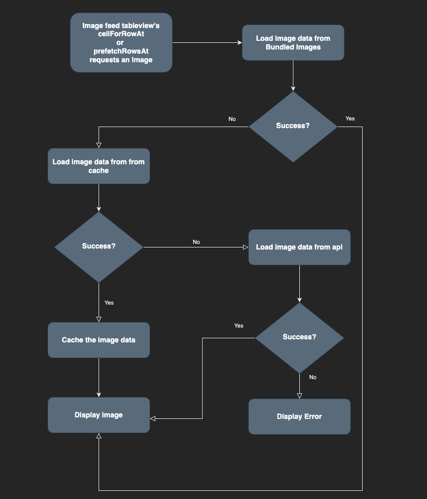
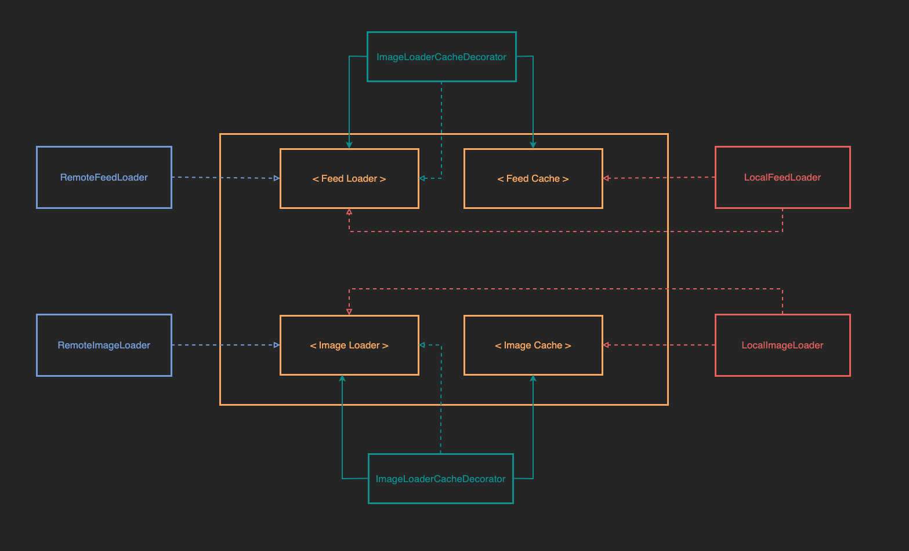
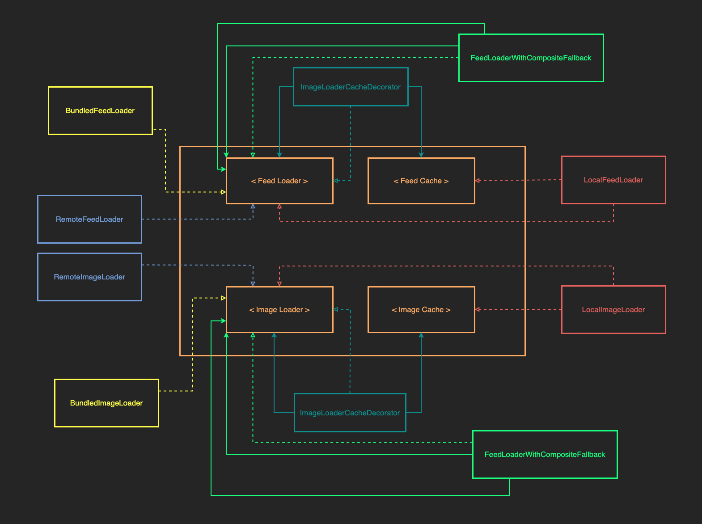
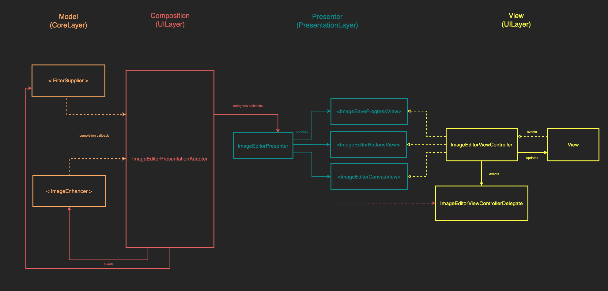

# Image Editor iOS App - CLEAN Architecture + MVP Pattern 
 
 
 


## Frameworks Used: `UIKit`, `CoreData`, `CoreImage`, `URLSession`

# Engineering Process 

### Identifying the Core Logic

In designing this application, there were 3 user experience curations I identified as the core logic or domain of the application.

- The feed - Users must see a feed of images from a server.
- The image editor - Users must be able to edit any image from their feed.
- Persistence - The user must be able to upload any changes they've made back to the server.

### User Interface  

I used two views in the UI - a feed view and an image editor view, built using the MVP pattern with adapters to facilitate indirect, unidirectional communication between the core layer and the UI.

### Modularity with Frameworks

I decided to create a modular application with multiple frameworks to demonstrate the separation of the layers, especially the layer holding the core logic. All the frameworks are a part of the "**ImageEditor**" Xcode project.

---

- `Core Layer` - platform agnostic framework that holds the core application logic and all of the essential implementations to facilitate that logic.
	- The `Core Functionality` folder defines as structs and protocols, the behaviors and models needed by the rest of the application.
	- The `Bundle Loading` folder holds the objects for loading dummy data.
	- The `API` folder holds all the objects responsible for networking. (URLSession)
	- The `Cacheing` folder holds all the objects responsible for cacheing. (CoreData)
	- The `Image Rendering` folder holds the objects that facilitate in the editing of images. (Core Image)

---

- `Presentation Layer` - platform agnostic framework that holds platform agnostic presentation logic - viewmodels and presenters. Created in a separate framework to allow multiple platforms to re-use the logic (macoS, iOS, iPadOS)
	- The `FeedView` folder holds the presentation logic for the feed view.	- The `EditorView` folder holds the presentation logic for the image editor view.
---

- `UI Layer` - iOS specific framework housing the UI elements for iOS (storyboards, and viewcontrollers)
	- The `Composition` folder holds the Composition logic for the views including the adapters for the MVP pattern, decorators for all objects dispatching any completed work to do so on the main queue, and proxies for separating the weak reference logic away from the presentation layer.
	- The `Controllers` folder holds all the ViewControllers used.
	- The `Views` folder holds all the view elements such as storyboards and tableview cells.

---

The `Presentation Layer` objects import the `Core Layer` and the `UI Layer` objects import either the `Core Layer`, the `Presentation Layer` or both. This demonstrates that dependencies flow outward and modularity is achieved. `Core Layer` components do not know about any implementation details.

Finally everything is composed into a working application in a separate project which is created as an iOS App. The frameworks are brought in as dependencies and linked together in an Xcode workspace.




## User Experience - The Feed

In designing the feed, I wanted the user to be able experience the application regardless of the conditions they are under. Therefore I implemented a 3 tier system for displaying the feed as can be understood by this flowchart:



At the core of this system is a `FeedLoader` protocol which allows the application to use different implementations of the `FeedLoader` depending on the specific stage of fallback it's in. The 3 implementations are: 

- `RemoteFeedLoader` - Fetches the feed from the server.
- `LocalFeedLoader` - Fetches the cached feed from a data store (CoreData)
- `BundledFeedLoader` - Fetches dummy feed with bundled images.

With these 3 implementations in place, a user will never experience an empty feed.

### Images

Since the feed received from the API is simply image data with a url that points to the actual location of the image, the design for loading an image works in reverse in order to avoid unnecessarily expensive api calls. If the image is cached, then it will display the image from cache instead of the api. The feed is still being loaded from the api so if there is a new item on the server, it will not be found in the cache and will be loaded from the api endpoint.


Like the feed, it uses a protocol `ImageLoader` and 3 separate implementations to achieve different levels of security against a negative user experience.

- `BundledImageLoader` - Fetches bundle image for given feed item.
- `LocalImageLoader` - Fetches cached image for given feed item.
- `RemoteImageLoader` - Fetches image for given feed item from api endpoint.


### Cacheing with Decorators

In order to keep the `ImageLoader` and `FeedLoader` abstractions from violating the Interface Segregation Principle, I identified the cacheing functionality in 2 new protocols: `Image Cache` and `Feed Cache`. The `LocalFeedLoader` and `LocalImageLoader` classes conform to these protocols.  

The composition of the "Loading" and "Cacheing" functionalities is then defined in Decorators: `FeedLoaderCacheDecorator` and `ImageLoaderCacheDecorator` which both inherit from their respective Loader protocols in order to be placed in any place that needs one. These decorators are intialized with a Loader and Cache objects.



A decorators are used to compose RemoteLoader completions and cache the results before returning the results without having Loader protocols gain extra responsibility of Cacheing, since not every loader will be able to cache. A remote loader can never cache, only a local one.

### Composition with Composites

 The composition of the diffent layers happens in the `SceneDelegate` using the `FeedLoaderWithFallbackComposite` and `ImageLoaderWithFallbackComposite` classes which like the Decorators, inherit from the loaders and add composition functionality. Created with 2 Loader objects, they pass on the load request to the fallback loader object on the failed load of the main loader object. 
 


By using the abstractions, we can create a composition that uses any implementations as the parameters of a composition (even another composition!).

### Usage:
With this, we initialize any object that needs both a feed loading and image loading functionality objects composed like this:

```
			feedLoader: FeedLoaderWithFallbackComposite(
                primary: FeedLoaderWithFallbackComposite(
                    primary: FeedLoaderCacheDecorator(
                        decoratee: remoteFeedLoader,
                        cache: localFeedLoader),
                    fallback: localFeedLoader),
                fallback: bundledFeedLoader),
                
            imageLoader: ImageLoaderWithFallbackComposite(
                primary: ImageLoaderWithFallbackComposite(
                    primary: bundledImageLoader,
                    fallback: localImageLoader),
                fallback: ImageLoaderCacheDecorator(
                    decoratee: remoteImageLoader,
                    cache: localImageLoader),
```
All the logic has been abtracted from the lower levels and composed in the top composition layer without the lower level objects needing to know any more than asking for an item to be loaded.

## User Experience - The Image Editing

The image editor is created similarly to the feed with abstractions for the different components. Since there is only one implementation of each of these and no complex composition of them, let's focus on the UI layer, which is similarly built for the feed. The design is an MVP pattern with an adapter to facilitate indirect, unidirectional communication between the core layer implementations of the `ImageEnhancer` and `FilterSupplier` abstractions and the UI. The implementations are Core Image wrappers that provide either a filter or an adjustment of an image setting and return the new image data. 




The `ImageEditorPresentationAdapter` conforms to the `ImageEditorViewControllerDelegate` protocol and the `ImageEditorViewController` communicates events to it via the delegate functions. It performs the image rendering using the core layer models, and communicates completion to the `ImageEditorPresenter` which then communicates to a specific View, the updated presentable data it should render. In this case all the logic is handled by one view, but the different view protocol abstractions allow us to break the ImageEditorViewController up into smaller ViewControllers. We can already see this at work through the conformance of `ImageEditorViewController` to each view protocol in a separate extension, where the logic to hand that update is also stored.

## User Experience - Persistence

The logic for saving the image is also stored in the `ImageEditorPresentationAdapter` but can be separated out later. It uses the same architectural principles from the other two features with different components. 


# Model Specs and Corresponding JSON Payloads

### Image Data

| Property | Type |
| --- | --- | 
|`url`|`URL`|
|`created`|`Date`|
|`updated`|`Date`|

### Payload Contract
```
[
   {
      "url": "https://images.pexels.com/photos/160846/french-bulldog-summer-smile-joy-160846.jpeg",
      "created": "Mar 14, 2018 6:50:24 PM",
      "updated": "Mar 14, 2018 6:50:24 PM"
   },
   {
      "url": "https://images.pexels.com/photos/186861/pexels-photo-186861.jpeg",
      "created": "Mar 14, 2018 6:54:22 PM",
      "updated": "Mar 14, 2018 6:54:22 PM"
   },
   ...
] 
```

### Image Upload Endpoint

| Property | Type |
| --- | --- | 
|`url`|`URL`|

### Payload Contract

```
{
  "url": "http://eulerity-hackathon.appspot.com/_ah/upload/AMmfu6aW-5uO3iFSJCZZ7PU-rSXLmX0Q2UU64uL0j0cIGlJ7C-VR1WrQdTDzE_KLYL8jNDnlsq6ZGfQT0GJUxs1EYiFP-UFw1uINzFxguSWFpXhaguJxOCTEMVFCTPCIhDSrTMOQ3dcOKvakZlU8rreLjZ-u0hWW_QiKaQyXJIkZQ8O0SOl1FVZN_EVD7DmAQ3z3UKlKorbhuyAzVTPiwkrtWDVuunuCpQ/ALBNUaYAAAAAYh1GV6HL6Ce2K2IbwUQorqm0c1Nb7AVD/"
}
```
